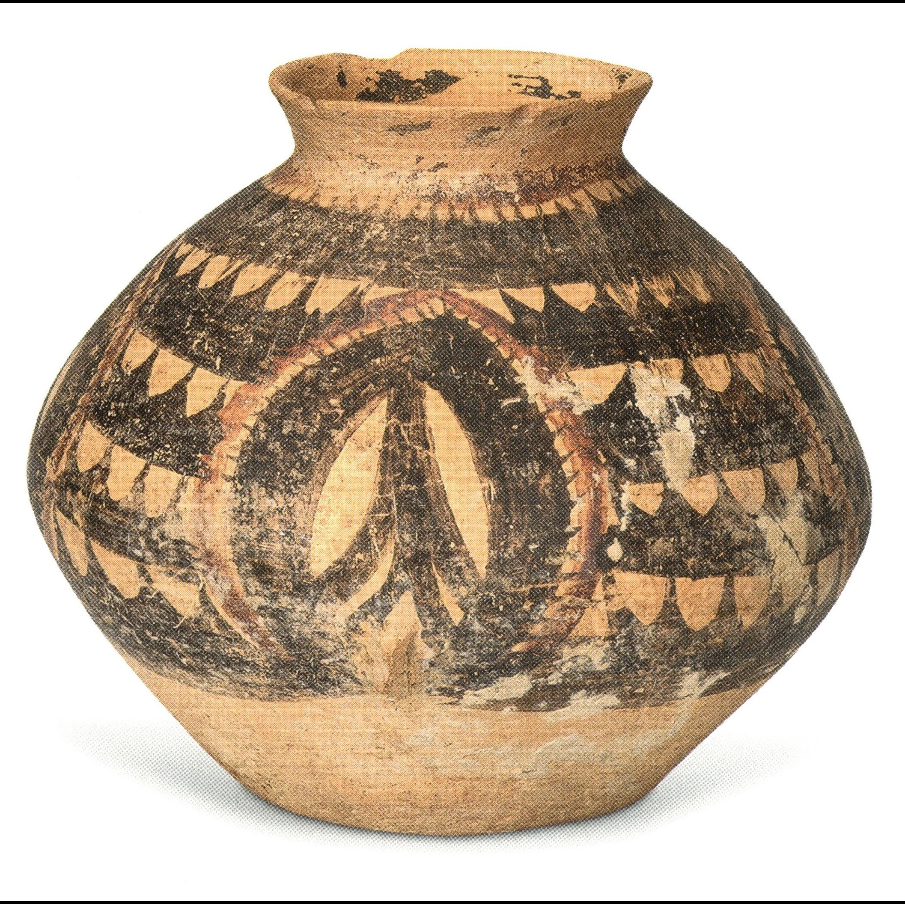
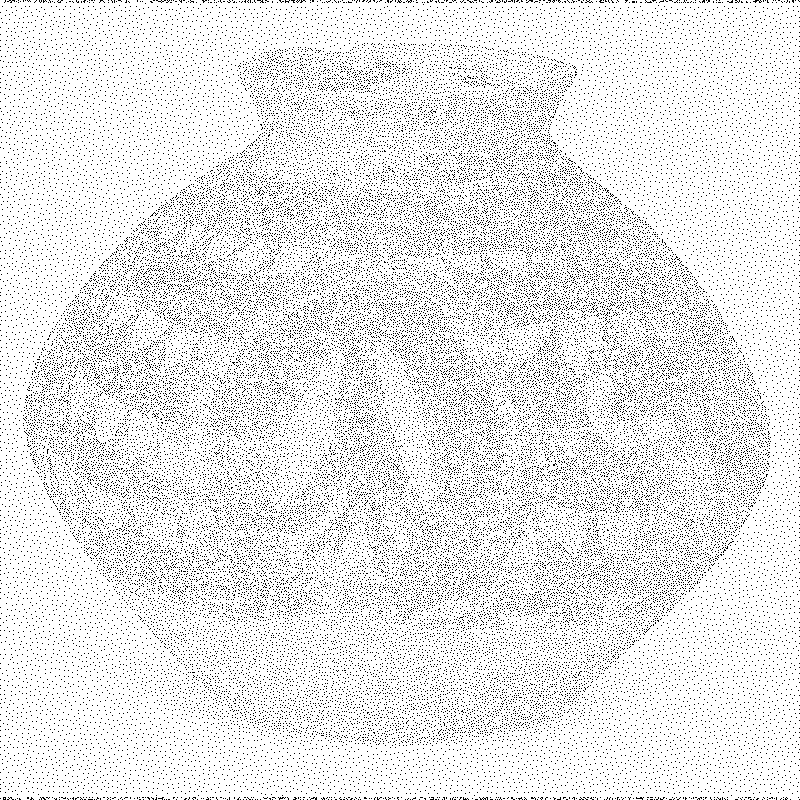

This project implements a Poisson Disk Distribution algorithm by Cem
Yuksel on images provided by Xiaohan Zhao. References below.

| Original Image | Resulting Image |
| -------------- | --------------- |
|  |  |

## References

C. Yuksel, “Sample elimination for generating poisson disk sample sets,” EUROGRAPH- ICS, vol. 34, no. 2, pp. 25–32, 2015.

X. Zhao, “From classification to matching: A cnn-based approach for retrieving painted pottery images,” Mendeley Data, vol. V1, 2023. [Online]. Available: https://doi.org/10.17632/xnk7s6xgxz.1
